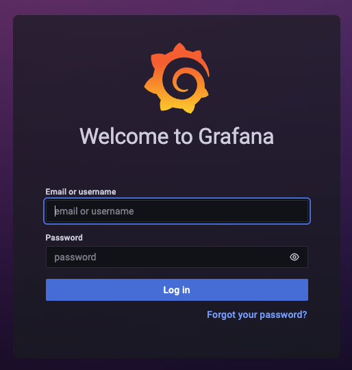

# Setup Grafana 
# Quick start: Setup local Grafana

We will walk through the setup of Grafana in a dev environment running in a Docker container on the developer's local desktop. Once Grafana is running, the configuration for running on a local container vs a cloud instance are similar.

### Local

```bash
sh setup_local_grafana_docker.sh
```

## Browse to your Grafana instance

### Local

If you ran the `setup_local_grafana_docker.sh` script from above you can see your Grafana instance at http://localhost:3000.

## Login to Grafana

Once you load the grafana page, you can then logon as Administrator (default username: `admin` password: `admin`). You will be asked to change the default password on first run.


